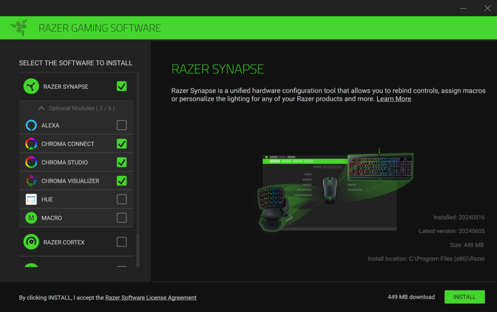
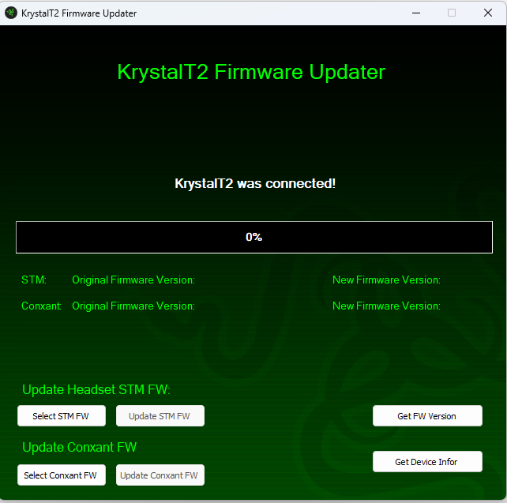
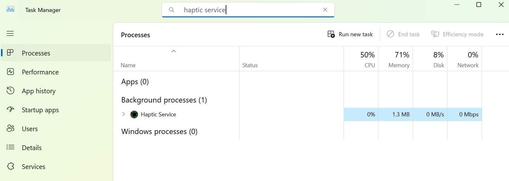
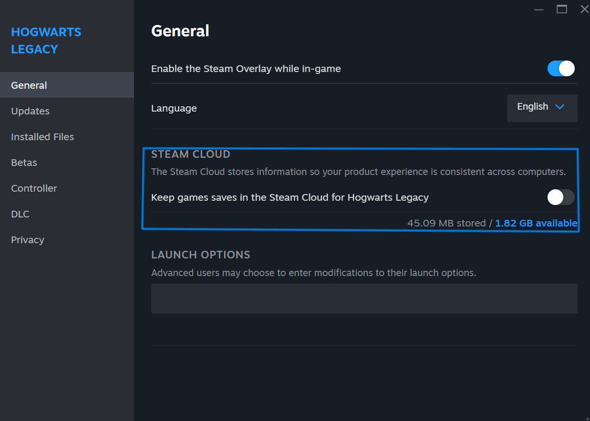
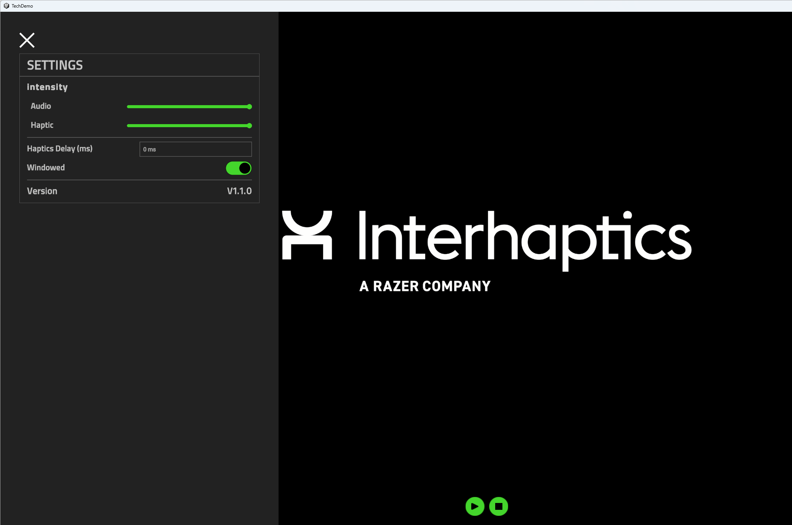

## Table of Contents
1. [Drivers Update](#drivers-update)
    1. [Razer Synapse 4 Setup](#razer-synapse)
    2. [Razer Kraken Firmware Update](#kraken-firmware-update)
    3. [Razer Sensa Devices Libraries](#razer-sensa-devices-libraries)
    4. [Razer Freyja Setup](#esther-device-setup)
2. [Apps](#apps)
    1. [Synesthesia App - Hogwarts Legacy](#synesthesia-app)
    2. [Tech Demo](#tech-demo) 

---

The Razer Sensa DevKit consists of the following hardware devices and software suite:
- Hardware:
  - Razer Kishi Ultra game controller (retail unit)
  - Razer Kraken v3 Hypersense headphones (retail unit; needs a firmware update) / Kraken v4 Pro (retail unit) [based on availability]
  - Razer Freyja haptic cushion (retail unit)
- Drivers/Firmware:
	- Razer Synapse 4
	- Razer Sensa device drivers
	- Razer Kraken v3 Hypersense custom firmware
- Demos
  - Hogwarts Legacy PC Version
  - Tech Demo

## 1. Drivers Update 

### 1.1. Razer Synapse 4 Setup  (Location: Drivers\Kraken)

- Launch the Razer Synapse 4 setup from the Synapse executable (Location: Drivers\Synapse\Synapse 4). The latest version can also be downloaded from this link: https://www.razer.com/synapse-4
- Check the Chroma options during setup.
- After the setup is finished sign in with your Razer Id or create one to get started (or log in as a Guest). 
- If a reboot is required, restart your PC.

### 1.2. Kraken v3 Hypersense Firmware Update  (Location: Drivers\Kraken)

- Plug the Razer Kraken Hypersense device into a USB port of your PC.
- Open the folder `Drivers\Kristal - FactoryFWUKrystalT2STM32_v1.02.03_20211111`. Launch the executable `FactoryFWUKrystalT2STM32.exe`.
- Click on the `Select STM FW` button. A file input popup should appear for bin file.
- Select the Firmware `Jaycee_HapticFW_V1.2.5.9` bin file and open it. The software window should update itself to display the selected file path.
- Click on the `Update STM FW` button. Wait until the loading bar indicates 100%.
- You can close the software, your device firmware is now updated.

### 1.3. Razer Sensa devices libraries  (Location: Drivers)

- Launch `Install_RzInterHaptics_Inbox_1.x.x.x.exe` to install the Razer Sensa device libraries. [1.x.x.x - current version of drivers]

!Only for Kraken v3 Hypersense. These instructions do not apply if you have Kraken v4 Pro.
- Close Synapse 4 (just to be sure that the RzInterhaptics.dll is not loaded)
- Rename RzInterhaptics.dll to RzInterhaptics.dll.bak inside the C:\Program Files (x86)\Interhaptics\RazerAppEngine\x64 folder
- Copy the dll files from C:\Program Files (x86)\Interhaptics\RzInterHaptics\x64 to C:\Program Files (x86)\Interhaptics\RazerAppEngine\x64
- Open Razer Synapse 4. Go to the Razer Freyja Tab and press the Launch Sensa HD Haptics Button. Check that Haptic Source is Sensa HD Games. If it is Audio-to-Haptics switch it to Sensa HD Games.

### 1.4. Razer Freyja Setup 

#### How to setup Razer Freyja

- Put the electrical plug into the socket and attach the cable to the Razer Freyja haptic cushion.
- Turn on Esther by pushing the power button.
- Plug the USB dongle into your PC.
- LED indicator must be solid green to be connected

#### Button functionalities

- **Power:** Turn ON/OFF the device.
- **Haptic Intensity:** Select general haptic intensity of the device. From level 1 (low) to level 6 (high).
- **Source:** Select between USB dongle (Green) and Bluetooth (Blue, not supported at the current stage).
- **Important Note:** If the light is blinking green, plug the USB dongle in another port. If the light is blue (blinking or solid) that means that the device is in BLuetooth mode and it should be changed by pressing the Source button to the USB 2.4 dongle connection. 

## 2. Apps 

### 2.1 Synesthesia App  (Location: Synesthesia)

##### 2.1.1 Overview

The Synesthesia engine integrates the Chroma DLL enabled games with various Razer Sensa haptic devices to provide a synchronized gaming experience that involves dynamic haptic feedback based on in-game events. The DevKit contains an example of the Hogwarts Legacy haptic integration. A complete documentation on Synesthesia can be found at this link: [https://www.interhaptics.com/doc/chroma-sensa/#synesthesia ](https://doc.wyvrn.com/docs/wyvrn-sdk/wyvrn-configuration/haptics/)

The Synesthesia apps can be found in the folder `ReleaseConsole`. The engine is shipped in Synapse 4 when Esther and Kraken V4 Pro will launch.  

To use the console version instead of the production version of Synesthesia (included in Synapse 4) follow the steps below.

- Open Razer Synapse 4. Go to the Razer Freyja/Kraken V4 Pro tab and press the Launch Sensa HD Haptics Button. Check that Haptic Source is Sensa HD Games. If it is Audio-to-Haptics switch it to Sensa HD Games.

- Open Task Manager. Look for the Haptic Service background process and close it.

- Open the Synesthesia app downloaded from https://github.com/Interhaptics/RazerSensa_DevKit and test the setup with ChromaFakeClient and the following commands load; active; play which will appear when starting the app. 

##### 2.1.2 Test Haptics with Chroma Sensa integrated games (Case: Hogwarts Legacy)

The following instructions are for the Hogwarts Legacy game, but can be applied to any game from the following link - https://www.razer.com/chroma-workshop#--sensa-games (ex: Final Fantasy XVI, Silent Hill 2, Sniper Elite: Resistance, Frostpunk 2, Symphonia etc) 
- Install the PC (Steam/Epic) version of Hogwarts Legacy.
- Plug in the Razer Sensa haptic devices.
- Check that Hogwarts Legacy is switched on as Chroma App. 
- Open Razer Synapse 4. Go to the Razer Freyja/Kraken V4 Pro tab and press the Launch Sensa HD Haptics Button. Check that Haptic Source is Sensa HD Games. If it is Audio-to-Haptics switch it to Sensa HD Games.

- Launch the Hogwarts Legacy game.
- Stupefy! 

*If you want to see the haptic effects played or want to add a custom haptic folder (in case on a QA process skip the previous folder and just follow the 2.1.1 steps. After this copy the custom haptic folder inside the Synesthesia app HapticFolders and launch the game - image below contains the Hogwarts Legacy calls example as they appear during the game inside the Synesthesia console app)

**Haptics is implemented on all the game events. If you have not played Hogwarts Legacy, install this save file through this quick guide:
- Start up the game from your Steam/Epic account. Once it shows the Hogwarts letter, exit the game.
- Disable Steam Cloud for the save games of Hogwarts Legacy. Right-click on Hogwarts Legacy (see image below).

- In your file explorer go to `C:\Users\<Your USERNAME>\AppData\Local\Hogwarts Legacy\Saved\SaveGames`
- Make duplicates of all the folders at that location (should be labeled with numbers). 
- Delete the content of the original folder. Unpack HogwartsLegacySaveGame.zip in the now empty folder.

### 2.2. Tech Demo  (Location: TechDemo)
- Close Synesthesia Console
- Decompress the file TechDemo_V[x.x.x].zip in a folder of your choice.
- Launch the TechDemo app from inside the unarchived folder.
- Press Play and enjoy the Razer Sensa Tech Demo.

[Back to Table of Contents](#table-of-contents)
