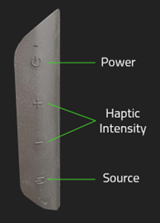
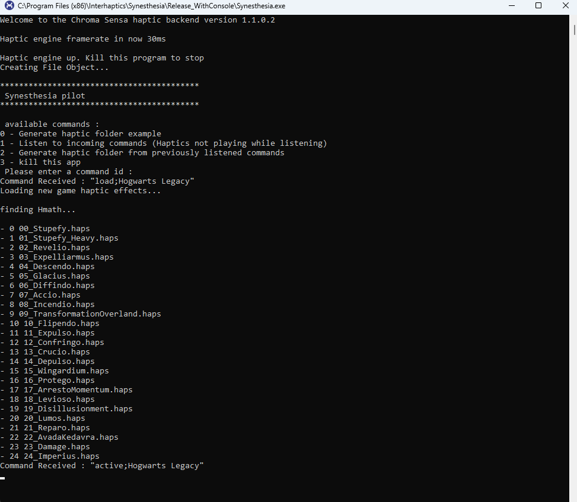

## Table of Contents
1. [Drivers Update](#drivers-update)
    1. [Kraken Firmware Update](#kraken-firmware-update)
    2. [Razer Sensa devices libraries](#razer-sensa-devices-libraries)
    3. [Esther Device Setup](#esther-device-setup)
2. [Apps](#apps)
    1. [Synesthesia App - Hogwarts Legacy](#synesthesia-app)
    2. [Tech Demo](#tech-demo) 
    3. [Mech Warrior 5 Mod](#mech-warrior-5-mod)

---

The Razer Sensa DevKit consists of the following hardware devices and software suite:
- Hardware:
  -- Razer Kishi Ultra game controller (retail unit)
  -- Razer Kraken headphones (retail unit + firmware/driver update)
  -- Razer Esther (demo unit)
- Software:
  -- Drivers/Firmware: Razer Sensa devices drivers + Razer Krake custom firmware
  -- Synesthesia modding tool with Hogwarts Legacy Chroma Sensa implementation
  -- Tech Demo
  -- Mech Warrior 5 Mod 
  

## 1. Drivers Update 

### 1.1. Kraken Firmware Update  (Location: Drivers\Kraken)

- Plug the Razer Kraken Hypersense device into a USB port of your PC.
- Open the folder `Drivers\Kristal - FactoryFWUKrystalT2STM32_v1.02.03_20211111`. Launch the executable `FactoryFWUKrystalT2STM32.exe`.
- Click on the `Select STM FW` button. A file input popup should appear for bin file.
- Select the Firmware `Jaycee_HapticFW_V1.2.5.9` bin file and open it. The software window should update itself to display the selected file path.
- Click on the `Update STM FW` button. Wait until the loading bar indicates 100%.
- You can close the software, your device firmware is now updated.

### 1.2. Razer Sensa devices libraries  (Location: Drivers)

- Launch `Install_RzInterHaptics_Inbox_1.x.x.x.exe` to install the Razer Sensa device libraries. [1.x.x.x - current version of drivers]

### 1.3. Esther Device Setup 

#### How to setup Esther

- Put the electrical plug into the socket and attach the cable to Esther.
- Turn on Esther by pushing the power button.
- Plug the USB dongle into your PC. (Avoid USB hubs)
- Enjoy your device.

#### Button functionalities

- **Power:** Turn ON/OFF the device.
- **Haptic Intensity:** Select general haptic intensity of the device. From level 1 (low) to level 6 (high).
- **Source:** Select between USB dongle (default) and Bluetooth (not supported at the current stage).

## 2. Apps 

### 2.1 Synesthesia App  (Location: Synesthesia)

##### 2.1.1 Overview

The Synesthesia project integrates the Chroma DLL enabled games with various Razer Sensa haptic devices to provide a synchronized gaming experience that involves dynamic haptic feedback based on in-game events (Chroma animations). The DevKit contains an example of the Hogwarts Legacy haptic integration.

The Synesthesia apps can be found in the folders. To avoid compatibility issues, unzip the folder in the `C:\Program Files (x86)\Interhaptics\Synesthesia` folder. The executables can be found in the `Release`, and `ReleaseConsole` folders.

Inside the folder there are also the following executables:

- `ChromaFakeClient.exe`: simulates a Chroma Sensa enabled app and can send messages
- `SynesthesiaStop`: terminates the synesthesia killer if it’s active or in the background
- `HapticFolders\`: some sample folders containing haptic configuration files and the haps haptic effects to be played (Hogwarts Legacy included here)
- `Release\`: folder containing release candidate version of Synesthesia (no window/background process)
- `ReleasewithConsole\`: folder containing console version of Synesthesia. This version is able to automatically create a Haptic Folder just by listening to a Chroma Sensa enabled app’s external messages.

##### 2.1. Example: Hogwarts Legacy

- Install the Steam version of Hogwarts Legacy.
- Navigate to the game folder. Navigate to the Chroma SDK Plugin Folder for Steam (C:\Program Files (x86)\Steam\steamapps\common\Hogwarts Legacy\Phoenix\Plugins\ChromaSDKPlugin\Binaries\Win64). Copy and paste Synesthesia/HogwartsChomaDLL/CChromaEditorLibrary64.dll in the Chroma SDK Plugin folder. Accept to substitute the file.
- Plug in the Razer Sensa haptic devices.
- Launch the Synesthesia app from the Synesthesia/ReleaseConsole folder (as Administrator). The Hogwarts Legacy is already inside the package and will intercept the Chroma Events sent by the game to play the corresponding haptics. The following messages can be seen on the Synesthesia with Console app.

- Launch the Hogwarts Legacy game.
- Stupefy!

### 2.2. Tech Demo  (Location: TechDemo)
- Decompress the file TechDemo_V[x.x.x].zip in a folder of your choice.
- Plug the custom firmware Kraken and the Kishi Ultra game controller in USB ports. For the Kraken check that the haptics button situated on the bottom right cup is on and at the right intensity for you (it has an off sound and 3 possible intensities from low to high).
- Launch the TechDemo app from inside the unarchived folder.
- Before pressing play, you can set the intensity of Haptics, Audio, or add a haptic delay.
- Press Play and enjoy the Razer Sensa Tech Demo.

### 2.3. Mech Warrior 5 Mod  (Location: MechWarrior5)

- Copy the folder `RzInterhaptics` from `MechWarrior5\HapticEngine\V2.0.1` to `C:\Program Files (x86)\Interhaptics\` (contains Clipboard Haptic Engine and custom haptic effects).
- Copy the contents of `MechWarrior5` to `C:\Program Files\Epic Games\MW5Mercs\MW5Mercs\Mods`. If the `Mods` folder does not exist, you must create it. A complete guide with pictures can be found inside the `MechWarrior5` folder: `Mod_setup.pdf`.

[Back to Table of Contents](#table-of-contents)
